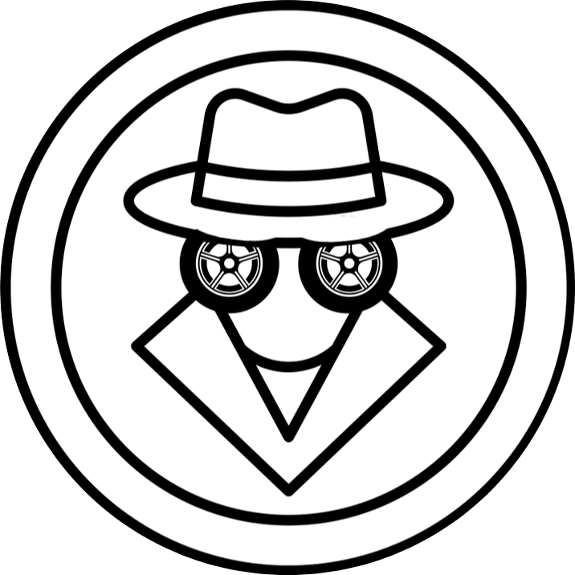

<p align="center">
  
</p>

<h1 align="center"> CANQuest Backend Server 🚗 </h1>

<p align="center">
  <em>You CAN do it.</em>
</p>

---

## Welcome, Hacker!
<p>
You have found my backdoor Unified Diagnostics Services (UDS) server that is implemented in every Completely Autonomous Ride (C.A.R.) the evil Admirable Prime Technologist (A.P.T.) produces using his Centralized Autonomous Regulatory Ecosystem (C.A.R.E)!

Can YOU help me recover the flags and restore autonomy back to the people of Deartropolis? Time is ticking...

— *The White Hat*
</p>

## Game Setup Instructions
1. Make sure you run the server in a **Linux** environment: native or a VM!
    - If you are running a VM, make sure you have **Bridged Adapter** as your network setting!
2. Download [setup.sh](setup.sh) OR easier access on the [CANQuest Download Page](https://thecanquest.com/) **NEW** if you have an ARM architecture (MAC M-Series Chips), please use the [arm-setup-script](arm-setup.sh).
3. `cd` into where you downloaded the file and run `sh setup.sh` to run the dockerized server container.
4. Connect to the server with your IP address. Connect to the game with the same IP address.
    - Find your IP address by running `ifconfig`
    - If you don't have ifconfig, run `sudo apt install net-tools`
    - For more help, visit the CANQuest Troubleshooting Page
5. That's all, folks! Run `candump vcan0` to see CAN messages over the vcan0 interface.

## Development Instructions
Please see [CONTRIBUTING.md](CONTRIBUTING.md)!

## Troubleshooting
1. Make sure all requirements in [requirements.txt](utils/requirements.txt) file are satisfied!
2. Verify your game and server are connected by the same IP address and are on the SAME WI-FI network 
    - Does not work with Ethernet
    - Make sure firewalls and VPNs are disabled
3. Make sure you have a `~/.canrc` file that contains 
```bash
[default] 
interface = socketcan
```

## Contact
Got questions? Contact us at [canquestgame@gmail.com](mailto:canquestgame@gmail.com)

 <p align="center"> Made with ❤️, 〽️, ☀️ and Python 🐍 </p>